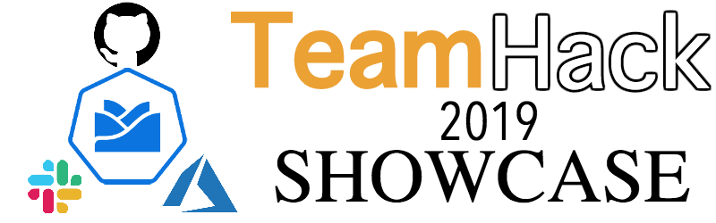

# Hack Showcase
<p align="center">
 
</p>

---

[](https://goreportcard.com/report/github.com/kyma-incubator/hack-showcase)

---

## Overview

The main goal of the showcase project is to create connectors for Github and Slack applications in Kyma environment. Connectors allow utilizing applications' functions inside Kyma ecosystem by communicating with corresponding API. Use it to trigger Lambdas on events incoming from third-party applications and react to them.

## Prerequisites

* **Kyma**
Connectors are configured to work inside Kyma ecosystem, so you need to install it locally or on a cluster. See the [Installation guides](https://kyma-project.io/docs/root/kyma#installation-installation) for details.

If you want to run connectors separately from Kyma, check certain connector's documentation for more information.

## Installation

Install Connectors locally or on cluster. For installation details, see corresponding guide:
* [Github Connector Installation](/chart/githubconnector/README.md)
* ~~Slack Connector installation~~

## Usage

Showcase covers user story described in the [`project concept`](https://github.com/kyma-incubator/hack-showcase/blob/master/docs/concept.md#reacting-to-prissue-comments), however considering the fact that connectors provide a way to communicate with external applications there are lots of possible use cases. Using the connector is as simple as deploying a new Lambda in Kyma - check corresponding [serverless documentation](https://kyma-project.io/docs/components/serverless) to find out more.

Example of configuration of GitHub Connector can be found [here](/docs/examples/demoscenario.md).

## Development
1. Fork the repository in Github.
2. Clone the fork to your `$GOPATH` workspace. Use this command to create the folder structure and clone the repository under the correct location:

    ```
    git clone git@github.com:{GitHubUsername}/hack-showcase.git $GOPATH/src/github.com/kyma-incubator/hack-showcase
    ```

    Follow the steps described in the [`git-workflow.md`](https://github.com/kyma-project/community/blob/master/contributing/03-git-workflow.md) document to configure your fork.

3. Install dependencies.

    Go to the main directory of the project in your workspace location and install the required dependencies:

    ```
    $ cd github-connector
    $ dep ensure -vendor-only
    ```

## Roadmap
For detailed plans for the future development, see the project [`roadmap`](https://github.com/kyma-incubator/hack-showcase/blob/master/docs/roadmap.md).
